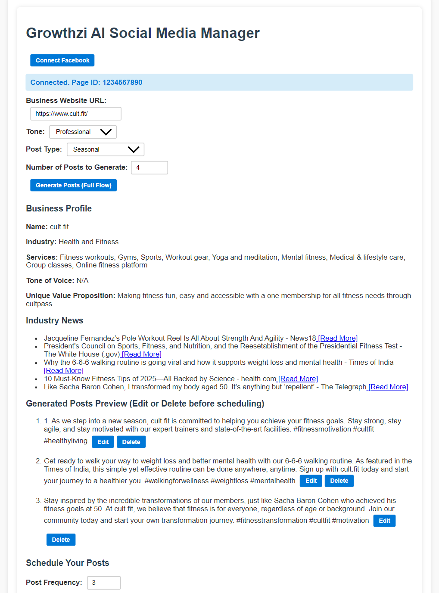

# Growthzi AI Social Media Manager

A web application for generating, previewing, scheduling, and publishing social media posts powered by AI. Connects to a Facebook page (simulated) and leverages Groq LLM API for content generation, allowing users to automate social media marketing workflows from business profile extraction and industry news to scheduled posts publishing.

## Table of Contents

- [Features](#features)  
- [Demo](#demo)  
- [Tech Stack](#tech-stack)  
- [Architecture & Flow](#architecture--flow)  
- [Setup and Installation](#setup-and-installation)  
- [Usage](#usage)  
- [API Endpoints](#api-endpoints)  
- [Project Structure](#project-structure)  
- [Key Components](#key-components)  
- [Future Improvements](#future-improvements)  
- [Known Limitations](#known-limitations)  
- [License](#license)

## Features

- Connect and simulate Facebook page linkage with mock access tokens  
- Fetch business profile details (name, industry, services, tone) from any business website URL using web scraping and Groq LLM inference  
- Retrieve relevant current industry news for the business  
- AI-powered generation of multiple social media posts based on business profile and trending news, customizable by tone and post type  
- Preview, edit, and delete generated posts before scheduling  
- Create a weekly post schedule with preferred posting days and frequency  
- Edit scheduled posts, delete posts, and reset schedules  
- Simulated publishing of scheduled posts to connected Facebook page with mock Facebook post links  
- Clear React frontend UI with intuitive flow and status/error messages

## Demo


## Tech Stack

- **Backend:** Python, Flask, Flask-CORS  
- **Frontend:** React, JavaScript, HTML, CSS  
- **AI Service:** Groq LLM API (llama-3.1-8b-instant model)  
- **Other:** BeautifulSoup (web scraping), Requests

## Architecture & Flow

1. User connects a Facebook page (simulated) via a connect button.  
2. User enters a business website URL → backend scrapes and analyzes the website to extract the business profile using Groq LLM.  
3. Based on extracted industry information, backend fetches relevant current news headlines.  
4. User selects preferences and triggers AI-generated post creation powered by Groq API.  
5. Generated posts are shown with edit and delete options for fine-tuning.  
6. User schedules posts on preferred days and frequency using the weekly planner.  
7. The schedule can be edited or reset.  
8. User publishes posts to the connected Facebook page using a simulation endpoint, which provides a mock Facebook post link.

## Setup and Installation

### Backend Setup

1. **Clone the repository:**

```
git clone 
cd 
```

2. **Create a Python virtual environment:**

```
python -m venv venv
source venv/bin/activate   # Unix/macOS
venv\Scripts\activate      # Windows
```

3. **Install dependencies:**

```
pip install -r requirements.txt
```

4. **Create a `.env` file in the root project directory with your API keys:**

```
GROQ_API_KEY=your_groq_api_key_here
```

5. **Run the Flask backend:**

```
python run.py
```

This will start the backend server on `https://ai-social-media-manager-yjgy.onrender.com/api`.

### Frontend Setup

1. Navigate to the React app folder (e.g., `frontend/` or root if combined):  

```
cd frontend
```

2. Install packages:

```
npm install
```

3. Start the React development server:

```
npm start
```

The React app will run on `` by default.

Make sure the backend API URL configured in `SocialMediaManager.jsx` matches your backend location (`https://ai-social-media-manager-yjgy.onrender.com/api`).

## Usage

1. Open the React frontend in your browser (`https://ankit1923-mr.github.io/AI_Social_Media_Manager/`).
2. Click **Connect Facebook** to simulate linking a Facebook page.
3. Enter the **Business Website URL** and click **Generate Posts (Full Flow)**. This triggers profile retrieval, news fetch, and AI post generation.
4. Preview, edit, or delete generated posts.
5. Set your preferred post frequency and days, then click **Generate Weekly Schedule**.
6. Edit or delete scheduled posts as needed.
7. Publish posts to the connected Facebook page; view the simulated Facebook post link below the publish confirmation.

## API Endpoints

| Endpoint                    | Method | Returned JSON Keys                                        | Sample Response                                                                                          |
|----------------------------|--------|----------------------------------------------------------|---------------------------------------------------------------------------------------------------------|
| `/api/facebook/connect`     | POST   | `status`, `fb_page_id`, `access_token`                   | { "status": "connected", "fb_page_id": "1234567890", "access_token": "mock_access_token" }              |
| `/api/facebook/publish`     | POST   | `success`, `post_id`, `post_url`                         | { "success": true, "post_id": "mock_post_123456", "post_url": "https://facebook.com/1234567890/posts/mock_post_123456" }  |
| `/api/business/profile`     | POST   | `name`, `industry`, `services`, `tone_of_voice`, `unique_value_proposition` | { "name": "Acme Corp", "industry": "Technology", "services": ["Software Development", "Cloud"], "tone_of_voice": "Professional", "unique_value_proposition": "Innovative solutions tailored to clients" } |
| `/api/news/industry-news`   | POST   | `news` (array of objects with `headline`, optional `url`) | { "news": [ { "headline": "New AI breakthrough announced", "url": "https://news.example.com/ai-breakthrough" }, { "headline": "Cloud computing trends 2025" } ] } |
| `/api/content/generate-posts` | POST | `posts` (array of strings)                               | { "posts": [ "Discover the future with Acme Corp.", "Innovative solutions for your business.", "Learn industry insights from Acme Corp." ] }        |
| `/api/weekly-planner`       | POST   | Weekday keys (`Mon`, `Tue`, etc.) with post content (string) | { "Mon": "Post 1 content here.", "Wed": "Post 2 content here.", "Fri": "Post 3 content here." }          |
| `/api/weekly-planner`       | GET    | Weekday keys with post content (string)                  | { "Mon": "Post 1 content here.", "Wed": "Post 2 content here.", "Fri": "Post 3 content here." }          |
| `/api/weekly-planner/{day}` | PUT    | Weekday keys with updated post content                   | { "Mon": "Updated post content for Monday.", "Wed": "Post 2 content here.", "Fri": "Post 3 content here." } |
| `/api/weekly-planner/{day}` | DELETE | Weekday keys with post content after deletion            | { "Mon": "Post 1 content here.", "Fri": "Post 3 content here." }                                       |
| `/api/weekly-planner/reset` | DELETE | `message`                                                | { "message": "Schedule reset successfully." }                                                         |


## Project Structure

```
/app
  /routes
    business.py
    news.py
    content.py
    planner.py
    facebook.py
  /services
    facebook.py
    generator.py
    scraper.py
    scheduler.py
frontend/
  src/
    SocialMediaManager.jsx
    index.css
.env
requirements.txt
run.py
.gitignore

```

## Key Components

### Backend

- **Flask API** handles scraping, AI generation, scheduling, Facebook simulation.
- **Groq API usage** for generating text content based on scraped profiles and news.
- **WeeklyScheduler** manages post scheduling saved in a JSON file.
- **Facebook simulation** mocks page connect and post publishing.

### Frontend

- **React component `SocialMediaManager.jsx`** provides UI for Facebook connection, profile/news fetch, generating posts, scheduling, preview/edit/delete, and publishing.
- Input validation, loading states, and error messages.
- Editable post previews before scheduling.
- Display of simulated Facebook post links after publishing.

## Future Improvements

- Integrate real Facebook Graph API for publishing to live pages.
- Add authentication and Facebook OAuth login.
- Improve UI/UX for scheduling calendar and drag-drop posts.
- Support multi-platform posting (Twitter, Instagram, LinkedIn).
- Add analytics dashboard for post engagement metrics.
- Use persistent database instead of JSON files.

## Known Limitations

- Facebook page connection and publishing are simulated only.
- Post links point to mock URLs, not live Facebook posts.
- Industry news fetched may be limited to simple APIs or mock data.
- Scheduler uses JSON files, not scalable for production.
- Basic UI without advanced scheduling/calendar views.
